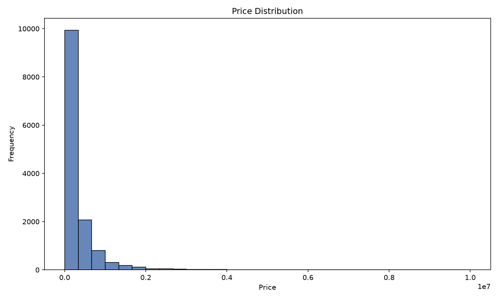
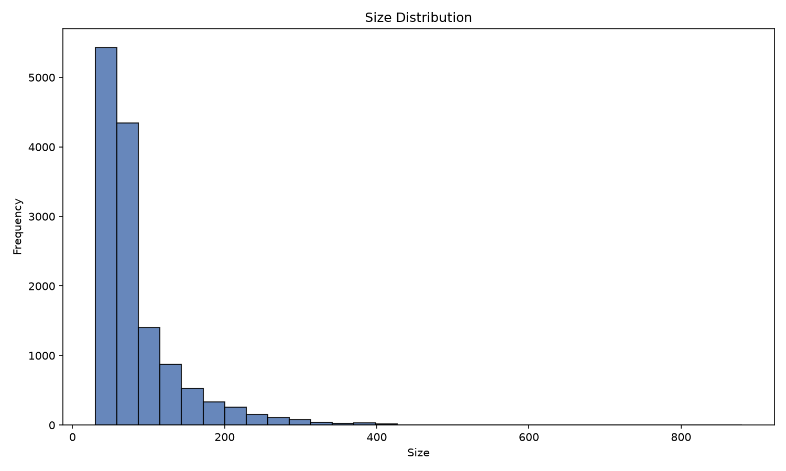
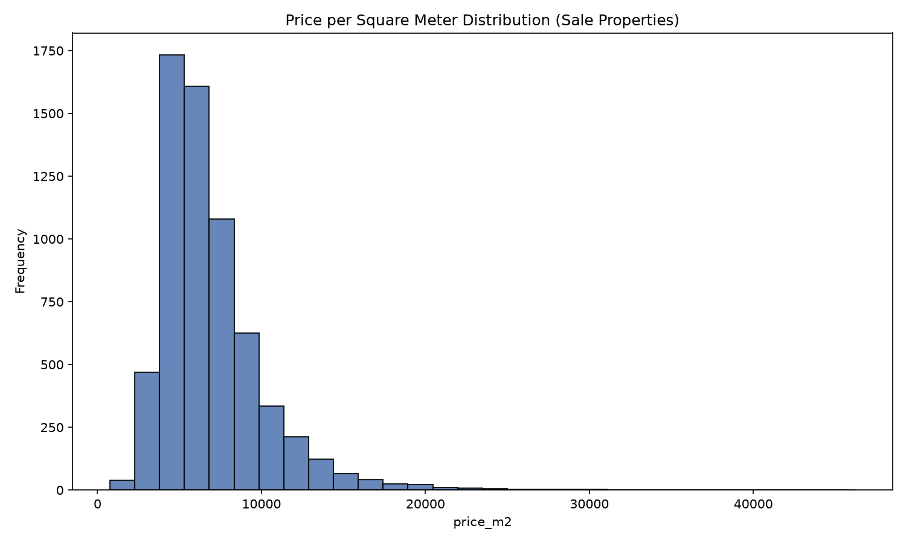
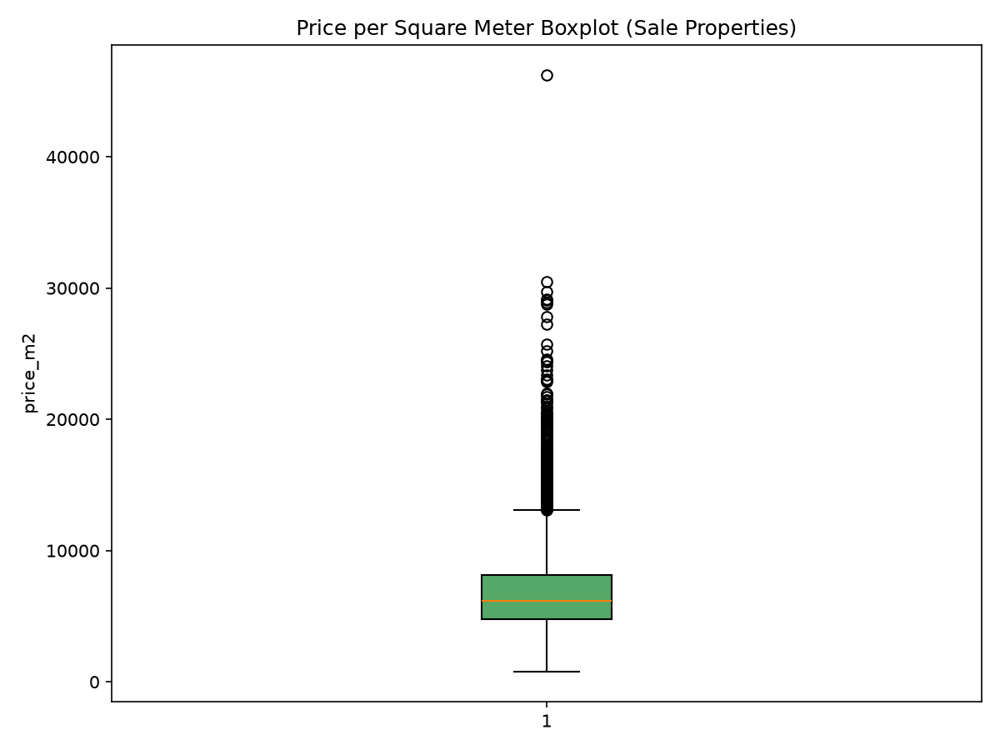
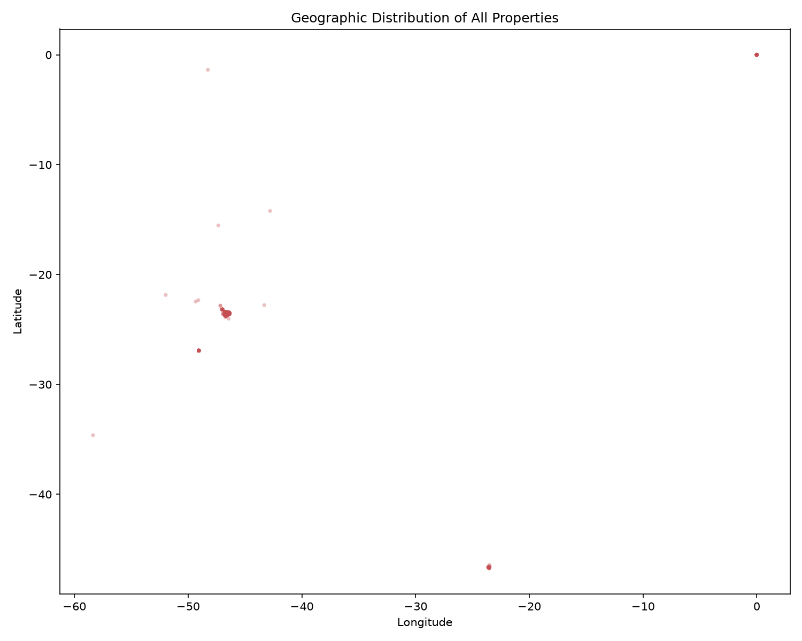
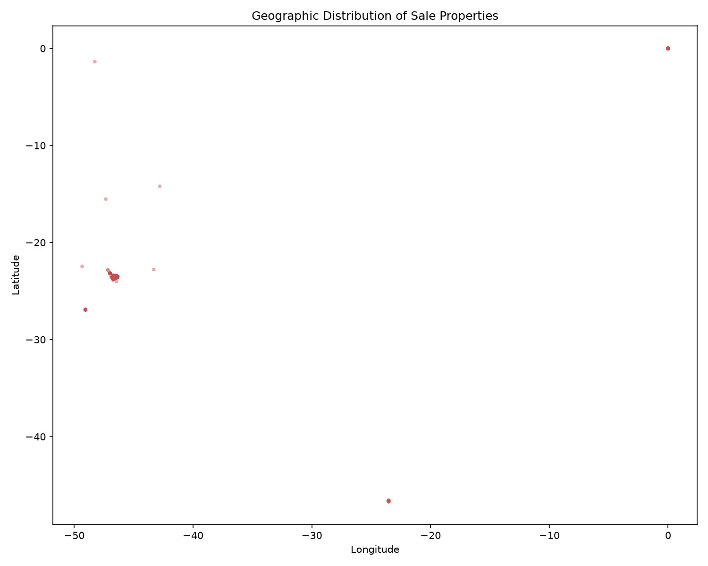

# Dataset Characterization Report

## Dataset overview

- Rows: 13640
- Columns: 16
- Column names: Price, Condo, Size, Rooms, Toilets, Suites, Parking, Elevator, Furnished, Swimming Pool, New, District, Negotiation Type, Property Type, Latitude, Longitude

### Data types

```json
{
  "Price": "int64",
  "Condo": "int64",
  "Size": "int64",
  "Rooms": "int64",
  "Toilets": "int64",
  "Suites": "int64",
  "Parking": "int64",
  "Elevator": "int64",
  "Furnished": "int64",
  "Swimming Pool": "int64",
  "New": "int64",
  "District": "object",
  "Negotiation Type": "object",
  "Property Type": "object",
  "Latitude": "float64",
  "Longitude": "float64"
}
```

## Missing values summary

| column | missing_count | missing_percentage |
| --- | --- | --- |
| Price | 0 | 0.0000 |
| Condo | 0 | 0.0000 |
| Size | 0 | 0.0000 |
| Rooms | 0 | 0.0000 |
| Toilets | 0 | 0.0000 |
| Suites | 0 | 0.0000 |
| Parking | 0 | 0.0000 |
| Elevator | 0 | 0.0000 |
| Furnished | 0 | 0.0000 |
| Swimming Pool | 0 | 0.0000 |
| New | 0 | 0.0000 |
| District | 0 | 0.0000 |
| Negotiation Type | 0 | 0.0000 |
| Property Type | 0 | 0.0000 |
| Latitude | 0 | 0.0000 |
| Longitude | 0 | 0.0000 |

## Negotiation type summary

| Negotiation Type | count | percentage |
| --- | --- | --- |
| rent | 7228 | 52.9912 |
| sale | 6412 | 47.0088 |

## Sale subset summary

```json
{
  "row_count": 6412,
  "price": {
    "count": 6412,
    "mean": 608624.1400499064,
    "std": 740451.5491921061,
    "min": 42000.0,
    "25%": 250000.0,
    "50%": 380000.0,
    "75%": 679000.0,
    "max": 10000000.0
  },
  "size": {
    "count": 6412,
    "mean": 78.61104179663131,
    "std": 50.87235861180962,
    "min": 30.0,
    "25%": 50.0,
    "50%": 62.0,
    "75%": 87.0,
    "max": 620.0
  },
  "latitude": {
    "count": 6412,
    "mean": -22.127512519109917,
    "std": 5.756660108843188,
    "min": -46.734483,
    "25%": -23.592848,
    "50%": -23.549693400000002,
    "75%": -23.51253425,
    "max": 0.0
  },
  "longitude": {
    "count": 6412,
    "mean": -43.705547415982075,
    "std": 11.271782904183686,
    "min": -49.3378145,
    "25%": -46.67352575,
    "50%": -46.62850605,
    "75%": -46.533612,
    "max": 0.0
  }
}
```

## price_m2 summary

```json
{
  "count": 6412,
  "mean": 6891.640879133787,
  "median": 6148.094816127603,
  "std": 3182.692495274854,
  "min": 755.5555555555555,
  "max": 46212.166666666664,
  "percentiles": {
    "1%": 2571.6657902735565,
    "5%": 3490.4023624953857,
    "25%": 4791.666666666667,
    "50%": 6148.094816127603,
    "75%": 8113.207547169812,
    "95%": 12774.551595744677,
    "99%": 18479.094412331462
  }
}
```

## Data quality findings

```json
{
  "coordinates_equal_to_0_0": 881,
  "negative_prices": 0,
  "zero_prices": 0,
  "negative_sizes": 0,
  "zero_sizes": 0,
  "duplicated_rows": 319
}
```

## Visualizations

### Price histogram



### Size histogram



### Price per square meter histogram



### Price per square meter boxplot



### Geographic distribution



### Sale-only geographic distribution


